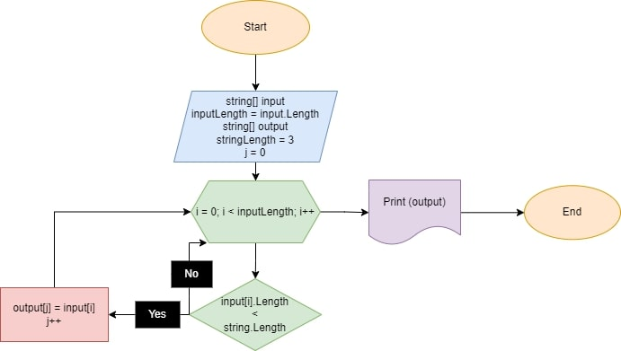

# Итоговая проверочная работа.

**Задача:** Написать программу, которая из имеющегося массива строк формирует массив из строк, длина которых меньше либо равна 3 символа. Первоначальный массив можно ввести с клавиатуры, либо задать на старте выполнения алгоритма. При решении не рекомендуется пользоваться коллекциями, лучше обойтись исключительно массивами.

**Алгоритм решения:**
1. Пользователь вводит некоторое количество строк, из которых формируется массив.
2. Перебираем заданные значения массива.
3. Проверяем каждое значение на соответствие условию элемента получаемого массива: *длина строки меньше или равна 3 символам*.
4. Если значение удовлетваряет условию, кладём его в получаемый массив и снова выполняем пункты 2 и 3. Если нет, выполняем пункты 2 и 3.
5. Повторяем пункты 2 и 3 до тех пор пока не рассмотрим каждое значение заданного массива.
6. Возвращаем новый, полученный массив.

**Блок-схема алгоритма:**

